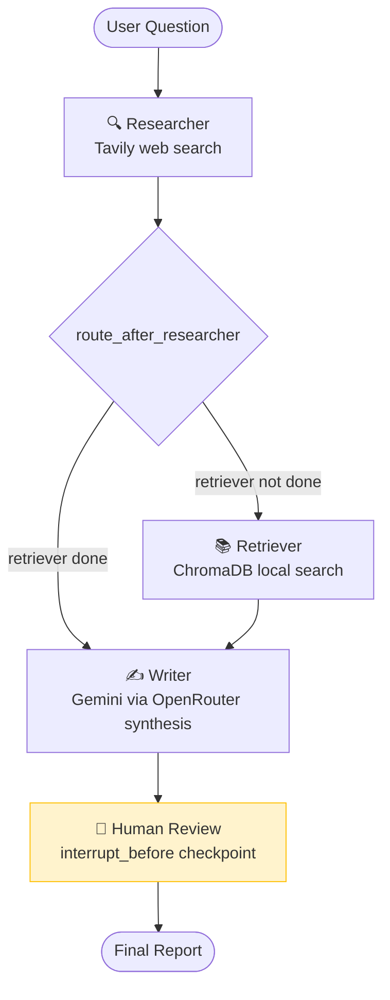

# Multi-Agent Research Assistant — LangGraph + OpenRouter + Tavily

> Three specialized agents — Researcher (web), Retriever (local docs), Writer (synthesis) — orchestrated by LangGraph with a human-in-the-loop review checkpoint. The most in-demand architecture pattern in production GenAI right now.


---

## Recent Changes

| Date | Change | Reason |
|------|--------|--------|
| May 2026 | Added OpenRouter as primary LLM provider (`OPENROUTER_API_KEY`) | Google free-tier daily quota hit frequently; OpenRouter routes to `google/gemini-2.0-flash-001` with no daily cap |
| May 2026 | `human_review_node` now returns `{"human_feedback": ...}` instead of `{}` | LangGraph 0.2.52 requires every node to return at least one state field — empty dict raises a validation error on resume |
| May 2026 | Added FastAPI REST wrapper (`src/api.py`) | Portfolio UI calls `/research`, `/status/{id}`, `/review/{id}` — Streamlit app still works alongside |
| May 2026 | Updated `_get_llm()` factory in researcher and writer agents | Provider-agnostic: OpenRouter first, falls back to direct Gemini if only `GOOGLE_API_KEY` set |

---

## Skills Demonstrated

| Category | Technologies / Concepts |
|----------|------------------------|
| **Agent Orchestration** | LangGraph StateGraph, conditional routing, directed graph topology |
| **State Management** | TypedDict, `Annotated[List, operator.add]` append semantics, state merging |
| **Human-in-the-Loop** | `interrupt_before`, MemorySaver checkpointing, `graph.update_state`, resume pattern |
| **Tool Calling** | `llm.bind_tools()`, Tavily API, structured LLM function calls |
| **Multi-Agent Design** | Single-responsibility agents, separation of research vs synthesis |
| **Provider-Agnostic LLM** | `_get_llm()` factory: OpenRouter first, direct Gemini fallback |
| **REST API** | FastAPI background tasks + polling pattern for long-running graph execution |
| **Testing** | pytest, isolated agent node tests, routing logic tests, no API calls in CI |

---

## What This Builds

**The Problem:** Single-agent systems struggle with research tasks that require breadth (public web) and depth (private docs) combined. A single LLM call can't effectively search the web, search local documents, and write a synthesis report — the context gets too long and the LLM loses focus.

**The Solution:** Three specialized agents, each doing one thing well:
- **Researcher**: queries Tavily for current, public web knowledge
- **Retriever**: queries ChromaDB for private, domain-specific document knowledge
- **Writer**: synthesizes both into a structured, cited report

A LangGraph state machine orchestrates the order, persists state between steps, and pauses for human review before finalizing.

**The Outcome:** A research assistant that combines internet knowledge with your private documents, with a human checkpoint before the final report is delivered.

```
User Question
      │
      ▼
[Researcher] — Tavily web search (5 sources)
      │
      ▼
[Retriever] — ChromaDB local doc search (top-4 chunks)
      │
      ▼
[Writer] — Synthesizes web + local results into report
      │
      ▼
[Human Review] ← PAUSES HERE — you approve or add feedback
      │
      ▼
Final Report (Markdown, downloadable)
```

---

## Architecture



See [docs/architecture.md](docs/architecture.md) for the full interrupt-and-resume flow diagram and state schema breakdown.

---

## Key Engineering Decisions

| Decision | Choice | Why |
|----------|--------|-----|
| **State accumulation** | `Annotated[List, operator.add]` | Messages and completed_agents must append, not overwrite. Without this, each agent's history is lost when the next agent runs. |
| **Routing via state** | Check `completed_agents` in routing fn | Decouples the topology from hard-coded order. Adding a new agent only requires updating the routing function, not rewiring edges. |
| **MemorySaver** | In-memory checkpointer | Simplest option for a portfolio project. Production: SqliteSaver (single node) or RedisSaver (distributed). |
| **interrupt_before** | `["human_review"]` | Pauses before the node executes — the node's output is the approved state. If you interrupt_after, you'd need the node to produce an "I'm waiting" result. |
| **human_review_node returns state** | `{"human_feedback": feedback}` | LangGraph 0.2.52+ validates that every node returns at least one state field. Empty dict raises `ValueError` on resume. |
| **temperature=0 for Researcher/Retriever** | Deterministic queries | Search queries benefit from determinism. Writer uses 0.3 for natural-sounding synthesis. |
| **Agents as pure functions** | `(state) -> dict` | Testable without the graph. Each agent's logic can be unit tested in isolation with a fake state. |
| **LLM provider** | OpenRouter (`google/gemini-2.0-flash-001`) | No daily quota cap. Identical model via OpenAI-compatible endpoint. Falls back to direct Gemini. |

---

## Tech Stack

| Component | Technology | Version | Why |
|-----------|-----------|---------|-----|
| Agent Orchestration | LangGraph | 0.2.52 | Industry standard for stateful multi-agent workflows |
| LLM | Gemini 2.0 Flash via OpenRouter | `langchain-openai` | No daily quota cap; same model, OpenAI-compatible API |
| Web Search | Tavily | tavily-python 0.5.0 | Purpose-built for AI agents: clean results, no HTML noise |
| Local Search | ChromaDB | 0.5.18 | Reuses Project 1's vector store for local document Q&A |
| State Persistence | MemorySaver | bundled with LangGraph | In-memory checkpoint for interrupt/resume within a session |
| REST API | FastAPI + uvicorn | ≥0.115.0 | Background task + polling pattern for long-running graph runs |
| UI | Streamlit | 1.40.1 | 4-stage state machine (input→researching→review→complete) |
| Tracing | LangSmith | auto via env var | Per-node trace shows exactly what each agent sent/received |

---

## Quick Start

```bash
# API Keys needed:
# OPENROUTER_API_KEY: free at https://openrouter.ai (recommended — no daily quota)
# TAVILY_API_KEY: free (1000 searches/month) at https://app.tavily.com
# GOOGLE_API_KEY: optional fallback at https://aistudio.google.com/apikey

git clone https://github.com/themoizqureshi/multi-agent-langgraph
cd multi-agent-langgraph

cp .env.example .env
# Fill in OPENROUTER_API_KEY and TAVILY_API_KEY

uv venv && source .venv/bin/activate
uv pip install -r requirements.txt

# Option A — Streamlit UI
streamlit run app.py
# Opens at http://localhost:8501

# Option B — FastAPI REST API
uvicorn src.api:app --reload --port 8002
# POST /research   → start a job, get thread_id
# GET  /status/:id → poll until "awaiting_review"
# POST /review/:id → approve or add feedback → polls to "complete"
```

**Optional:** Point to a local ChromaDB from Project 1:
```bash
# In .env:
CHROMA_DB_PATH=../rag-chatbot-langchain/chroma_db
```

## Running Tests

```bash
pytest tests/ -v
# 9 tests — all mocked, no API calls, runs in <2s
```

---

## Project Structure

```
multi-agent-langgraph/
├── src/
│   ├── state.py             # AgentState TypedDict with Annotated fields
│   ├── graph.py             # build_research_graph(), routing fn, run_until_interrupt(), resume_after_review()
│   ├── api.py               # FastAPI: /research, /status/:id, /review/:id — background + polling
│   ├── agents/
│   │   ├── researcher.py    # Tavily web search via tool calling; _get_llm() OpenRouter/Gemini
│   │   ├── retriever.py     # ChromaDB local document search
│   │   └── writer.py        # Synthesis from web + local; _get_llm() OpenRouter/Gemini
│   └── tools/
│       ├── web_search.py    # TavilySearchResults tool factory
│       └── doc_search.py    # ChromaDB retriever factory + search_local_docs()
├── app.py                   # Streamlit UI with 4-stage workflow
├── tests/
│   └── test_graph.py        # Routing logic tests, agent isolation tests
└── docs/
    └── architecture.md      # Mermaid graph + interrupt-and-resume flow
```

---

## Production Considerations

| Concern | Current State | Production Approach |
|---------|--------------|---------------------|
| **State persistence** | MemorySaver (in-memory, lost on restart) | SqliteSaver or RedisSaver; state survives server restarts |
| **Async human review** | Blocking Streamlit session | Pause → send email/Slack notification → resume via webhook; requires async job queue |
| **Parallel research** | Researcher → Retriever (sequential) | Fan-out: both run in parallel; merge before Writer — halves research time |
| **Agent quality evaluation** | No per-agent scoring | LangSmith custom evaluators; RAGAS context_recall on Retriever output |
| **Loop protection** | None (graph structure prevents loops) | Add `iteration_count` to state; routing fn returns `"error_handler"` if count exceeds max |
| **Tool errors** | Unhandled | Wrap tool calls in try/except; return error state; route to a fallback node |

---

## Lessons Learned

- First run: the Writer fired before the Retriever completed because `route_after_researcher` was checking `"retriever"` but `completed_agents` was populated with `"retriever_node"`. LangGraph doesn't validate routing key names against node names — the graph compiled and failed silently at runtime. Defensive logging in the routing function caught it.
- `Annotated[List, operator.add]` on state fields is easy to forget and hard to notice: without it, each agent's output silently overwrites the previous one. The symptom is the Writer only sees the most recent agent's results, not the accumulated history.
- LangGraph 0.2.52 added strict validation: every node must return at least one state field. `human_review_node` previously returned `{}` (valid in earlier versions) — this now raises `ValueError` on graph resume. Returning `{"human_feedback": state.get("human_feedback", "")}` fixes it without changing any logic.
- LangSmith per-node traces showed the Researcher was returning 5 Tavily results but 2 were from tangentially related articles. The Writer included them in the synthesis anyway. A relevance filter inside the Researcher node before writing to state would improve output quality significantly.
- `MemorySaver` stores checkpoint state in-process — restarting the server loses the interrupt. `SqliteSaver` is the minimum viable persistence for anything that needs to survive a restart or be handed off between sessions.

---

*Part of the [AI Engineer Portfolio](https://github.com/themoizqureshi) — Project 4 of 5.*  
*Previous: [Project 3 — Local LLM + Pinecone + FastAPI](https://github.com/themoizqureshi/local-llm-rag-pinecone)*  
*Next: [Project 5 — LLMOps Pipeline](https://github.com/themoizqureshi/llmops-pipeline)*
