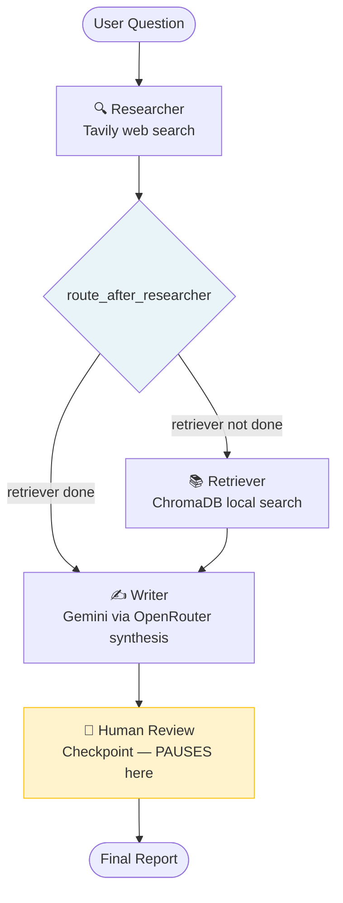

# Architecture — Multi-Agent Research Assistant

## Graph Topology



**The graph pauses at `human_review`** (yellow node) before executing it. The Streamlit UI surfaces this as the "Review & Approve" step. After the human approves (or submits feedback), the graph resumes and terminates.

## Agent Responsibilities

| Agent | Input from state | Output to state | Tool used |
|-------|-----------------|-----------------|-----------|
| Researcher | `question` | `web_search_results` | Tavily API |
| Retriever | `question` | `doc_search_results` | ChromaDB local |
| Writer | `question` + both results | `final_report` | None (synthesis only) |
| Human Review | `final_report` | `human_feedback` | You |

## State Schema

```python
class AgentState(TypedDict):
    question: str                                          # Immutable after init
    messages: Annotated[List[BaseMessage], operator.add]  # Append-only history
    web_search_results: Optional[str]                     # Set by Researcher
    doc_search_results: Optional[str]                     # Set by Retriever
    final_report: Optional[str]                           # Set by Writer
    completed_agents: Annotated[List[str], operator.add]  # Append-only tracker
    human_feedback: Optional[str]                         # Set at review checkpoint
```

`Annotated[List, operator.add]` fields use append semantics — LangGraph merges new list items rather than replacing the list.

## Interrupt-and-Resume Flow

```
graph.invoke(initial_state, config)
    │
    ├── researcher_agent() runs → state updated
    ├── retriever_agent() runs → state updated
    ├── writer_agent() runs  → final_report set
    │
    └── PAUSE (interrupt_before=["human_review"])
              ↓
         State serialized to MemorySaver
              ↓
         Streamlit shows draft report
              ↓
         Human approves (or adds feedback)
              ↓
         graph.invoke(None, config)  ← resumes from checkpoint
              ↓
         human_review_node() runs
              ↓
         Graph ends → final state returned
```

## Key LangGraph Concepts

| Concept | What It Does | Why It Matters |
|---------|-------------|----------------|
| `StateGraph(AgentState)` | Defines the graph schema and topology | Every node must match this TypedDict |
| `add_conditional_edges` | Routes to different nodes based on state | Enables branching without hard-coding order |
| `MemorySaver` | Persists state between interrupt and resume | Allows async human review without losing context |
| `interrupt_before=["human_review"]` | Pauses the graph before that node | The human-in-the-loop mechanism |
| `graph.update_state(config, {...})` | Injects data into a paused graph | How feedback gets from the UI into the graph state |
| `graph.invoke(None, config)` | Resumes from the last checkpoint | `None` = "continue from where you stopped" |
